# 🌸 Flower Shop – Scalable AWS Architecture

A simple online flower shop to demonstrate a scalable backend architecture on AWS, using EC2, Auto Scaling, CloudFront, and S3.

## 📦 Project Overview

**Architecture Components:**

- **Frontend** – hosted in **Amazon S3** (static website) and served via **CloudFront**
- **Backend** – Flask app running on **EC2** instances behind an **Application Load Balancer (ALB)**, managed by an **Auto Scaling Group (ASG)**
- **Order Storage** – orders are saved to **S3** as JSON files
- **Monitoring** – custom CloudWatch metric `OrderCount` is published every time an order is placed
- **Auto Scaling** – automatically adjusts number of backend instances based on order traffic

## 🔧 Technologies Used

- AWS EC2 + Launch Templates
- Auto Scaling Group (1–3 instances)
- Application Load Balancer (ALB)
- CloudFront + S3 static website hosting
- Python + Flask + Boto3
- CloudWatch Custom Metrics and Alarms
- IAM Roles and Policies
- Security Groups allowing inbound from CloudFront only

## 🛠️ Backend Logic

`app.py` handles the `/order` endpoint:

- Accepts `POST` requests with order data (name, address, flower type)
- Saves each order to S3 under the `orders/` folder
- Sends a custom metric to CloudWatch: `OrderCount = 1`

## 📈 Auto Scaling Logic

| Condition                    | Action            |
|-----------------------------|-------------------|
| OrderCount > 30 per minute  | Add 2 instances   |
| OrderCount ≤ 15 per minute  | Remove 2 instances|

Alarms are based on CloudWatch metrics with 1-minute granularity.

## 🚀 Load Testing

Use `load_test.py` to simulate real-time traffic with randomized flower orders:

```bash
python3 load_test.py
```

Modify `orders_to_send` and `delay` inside the script to increase load.

## 🔐 Security Notes

- ALB security group only allows inbound traffic from **CloudFront** IP ranges.
- Backend EC2 instances use an **IAM role** that allows:
  - `s3:PutObject` on the `orders/` path
  - `cloudwatch:PutMetricData` for custom metrics

## 📂 Project Files

- `app.py` – Flask backend
- `load_test.py` – Traffic generator for load testing
- `FlowerShopS3WriteAccess_AWS_Policy` – IAM policy for EC2 role
- `flower-backend.service` – Systemd unit file for running Flask app
- `index.html` – HTML code of main page

## 🎬 Screenshots and demonstration

**Scenario:** The online flower shop works well, but a peak in demand affects the business.

On busy days like March 8th, the backend slows down, and orders are not created properly. Customers can't wait and leave for other flower shops.  
The DevOps Engineer decided to use an Auto Scaling Group to handle high demand properly, increasing backend capacity from 1 to 3 instances.

---

### 🌐 Website Overview

Let's start with the main page of my website:  
  
As you can see, I'm using the domain: https://shoppng.online

This domain is added in Route 53:  
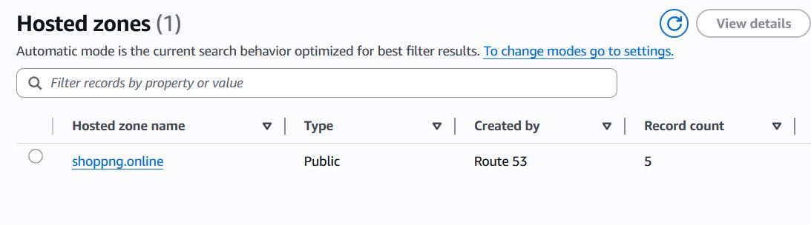

Then I received an SSL certificate via ACM:  
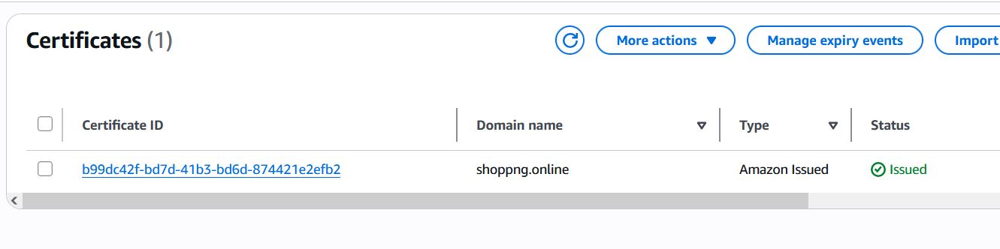

The website is served worldwide using CloudFront distribution:  
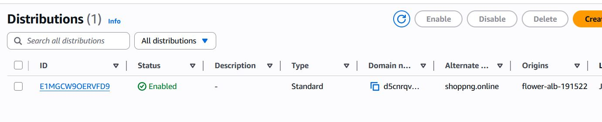

It has 2 behaviors - one for the main page, and one for the /order route:  
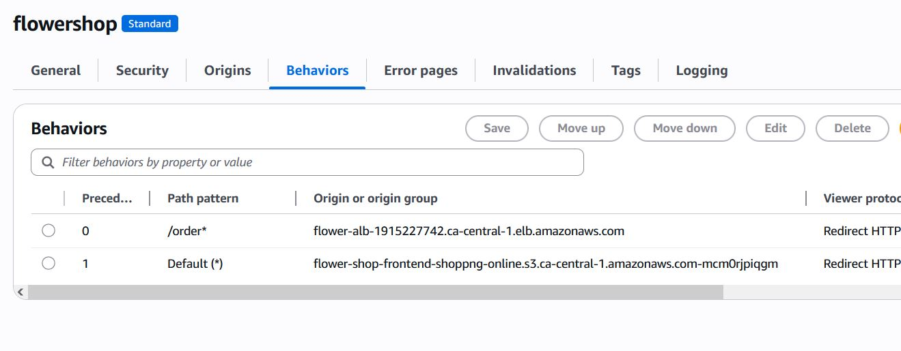

There are 2 origins: ALB and S3:  
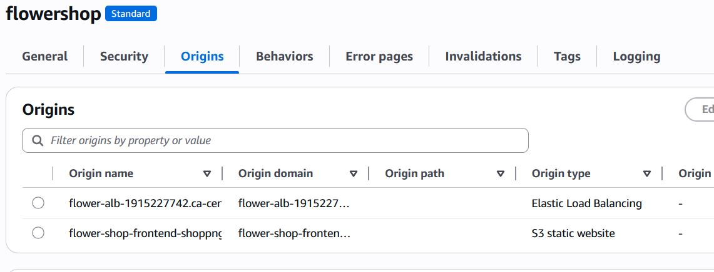

The main page is a static website hosted in an S3 bucket:  
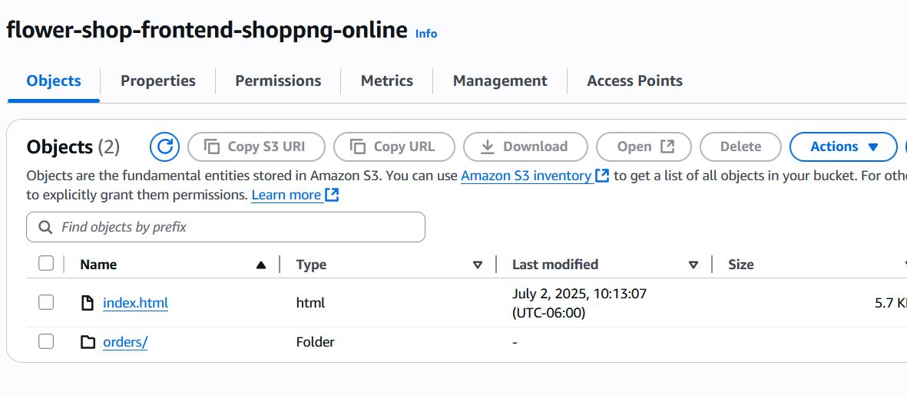

At the bottom of the page, you'll see the order form:  
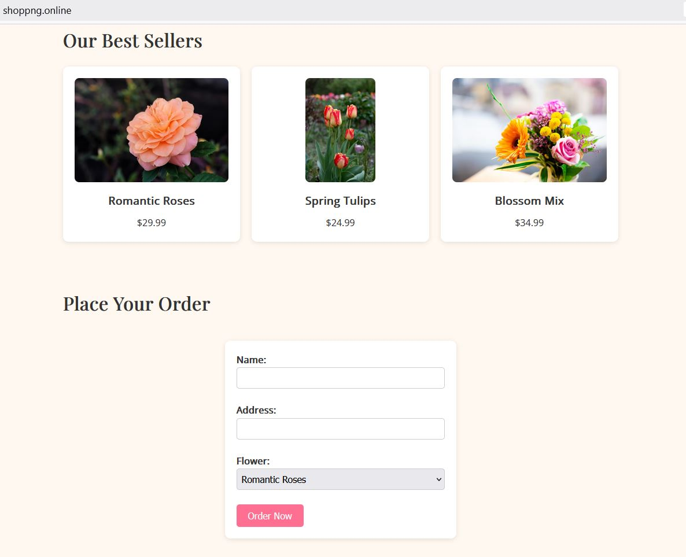

This form submits data to the backend (`app.py`) running on my EC2 instances.  
The backend receives the order and saves it as an object in the same S3 bucket (used for testing instead of a real database):  
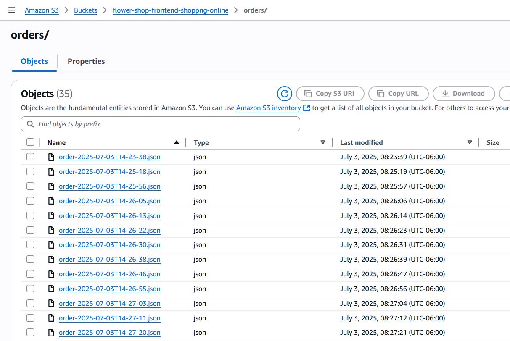  
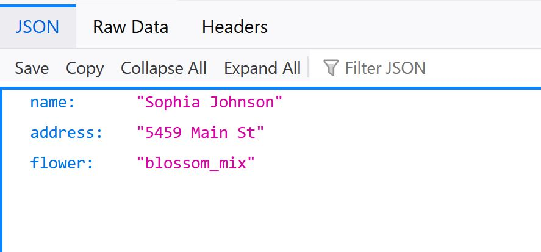

An Auto Scaling Group (ASG) handles instance creation and termination based on load:  
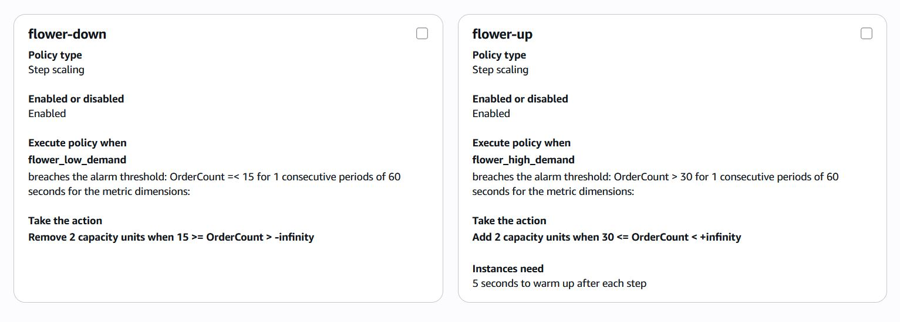

Instances are launched using a custom AMI:  
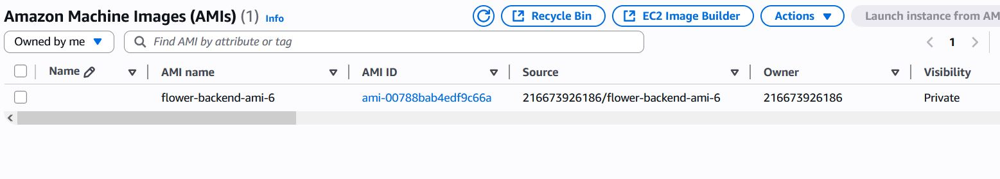

Launch template includes an IAM role for permissions:  
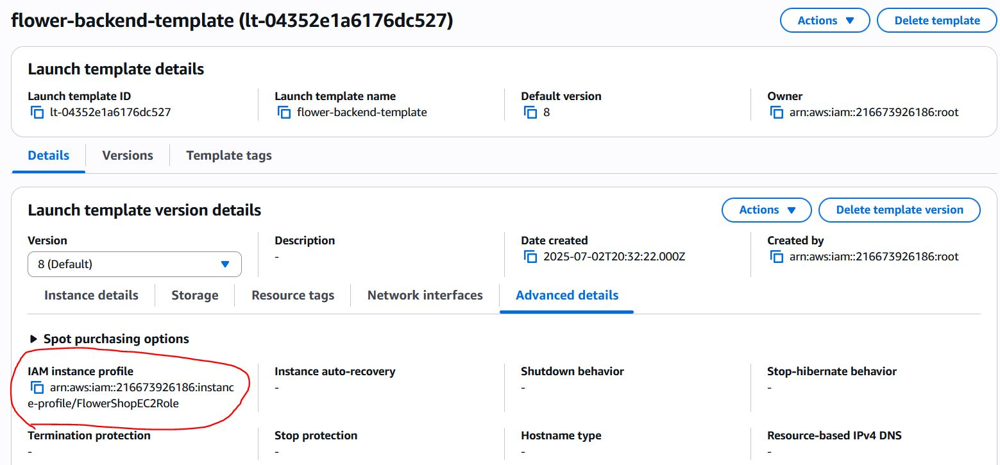

---

### 📉 Normal Load

Let's simulate a normal day with ~1 order every 8 seconds.  
I run `load_test.py`:  


Check the CloudWatch dashboard:  
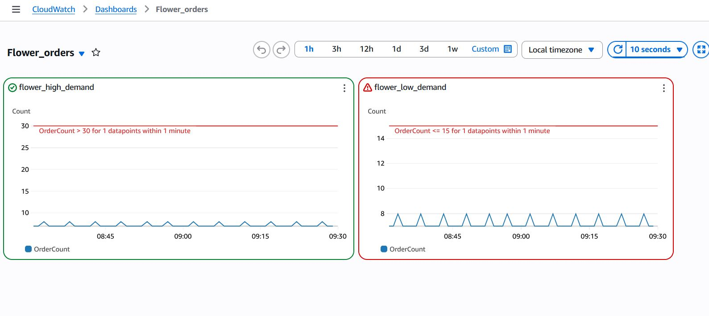

It has 2 graphs. The right one shows an alarm used by ASG to scale in when orders are less than 15 per minute.  
Only 1 EC2 instance is active:  
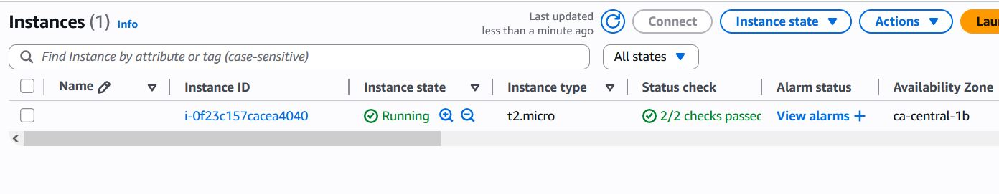

ALB under normal conditions:  
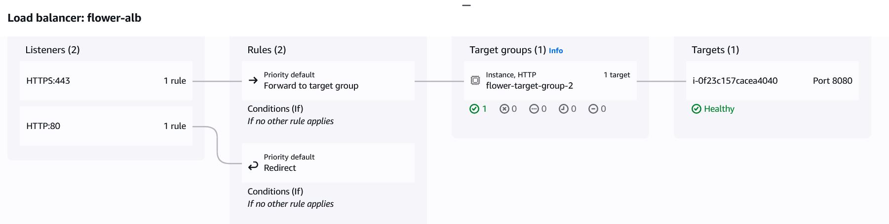

---

### 📈 High Load (Celebration Day)

Now imagine a celebration day with more than 200 orders per minute:  


CloudWatch metrics spike:  
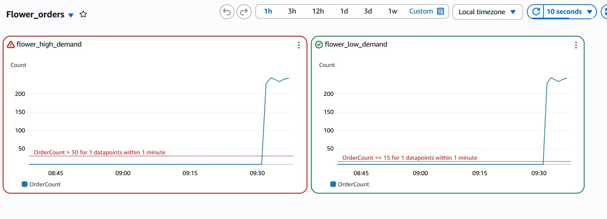

ASG scales out from 1 to 3 EC2 instances:  
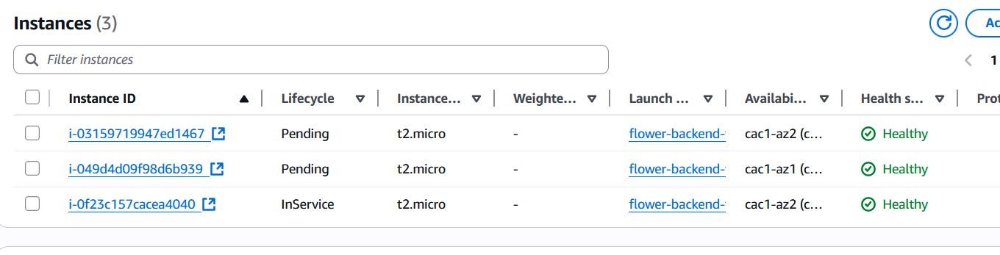  
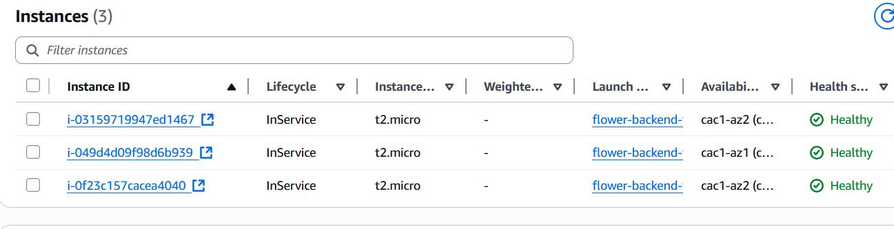  
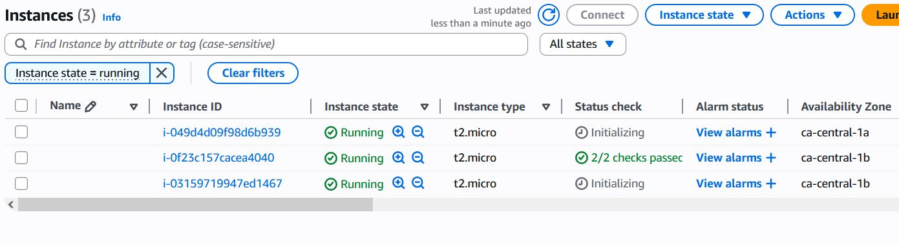

After a few minutes, ALB balances traffic across all 3 instances:  
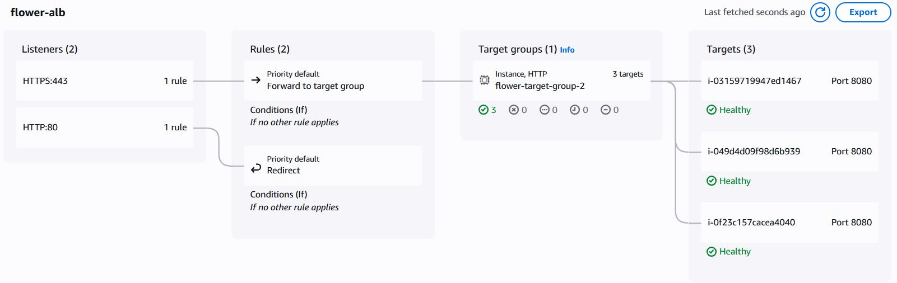

---

### 📉 Back to Normal

As the celebration ends, orders slow down again to one every 8 seconds:  
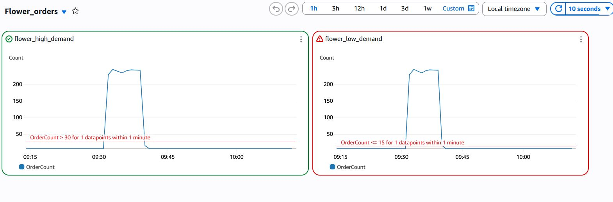

ASG scales in:  
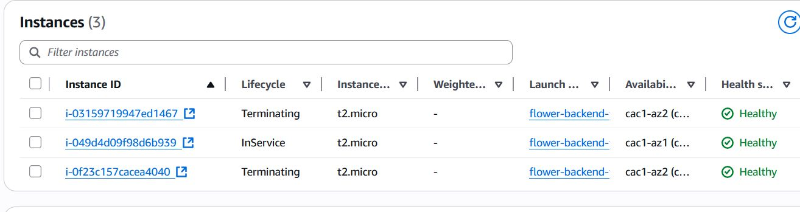  
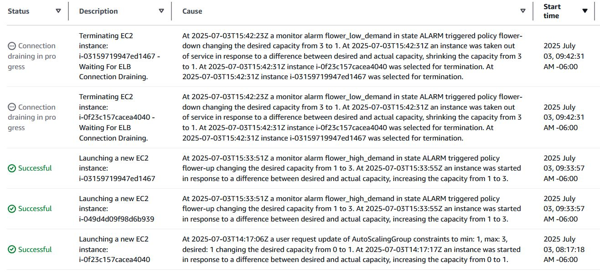  
  
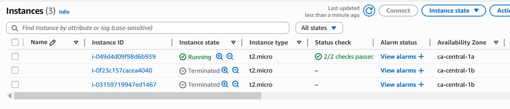

---

## ✅ Conclusion

I hope this demonstration helps you better understand how Auto Scaling works in response to traffic changes in a real-world scenario.

---

🛠️ **Built by**: Nikita Butakov

---

This project was built as part of a DevOps learning journey to practice AWS scalability, monitoring, and automation.

